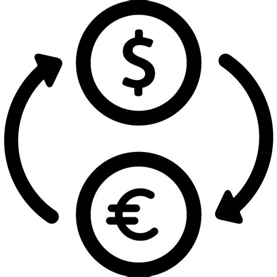

# exchange-rate

REST API for describing currencies and exchange rates.
Allows you to view and edit lists of currencies and exchange rates, and calculate conversion of arbitrary amounts from one currency to another.

[Technical requirements](https://zhukovsd.github.io/java-backend-learning-course/Projects/CurrencyExchange/).




## Technologies / tools:
- Java servlets
- JDBC
- PostgreSQL
- Docker
- Tomcat
- Maven


## API overview

### Currencies

#### GET `/currencies`

Returns list of all currencies.

```json
{
  "currencies": [
    {
      "code": "USD",
      "fullName": "United States Dollar",
      "sign": "$"
    },
    {
      "code": "CAD",
      "fullName": "Canadian Dollar",
      "sign": "C$"
    },
    "..."
  ]
}
```

Possible errors:
- InternalServerError (500)


#### GET `/currencies/:code`

Returns currency by given `:code`.

```json
{
  "code": "USD",
  "fullName": "United States Dollar",
  "sign": "$"
}
```

Possible errors:
- BadRequest (400) - when given `:code` is invalid or is missing
- NotFound (404) - when currency with `:code` not found
- InternalServerError (500)


#### POST `/currencies`

Adding a new currency to the base. Form fields - `code=`, `fullName=`, `sign=`.

```json
{
  "code": "USD",
  "fullName": "United States Dollar",
  "sign": "$"
}
```

Possible errors:
- BadRequest (400) - when given payload is invalid or empty
- NotFound (409) - when currency with `code=` already exists
- InternalServerError (500)


### Exchanges

#### GET `/exchanges`

Returns list of all exchanges.

```json
{
  "exchanges": [
    {
      "base": {
        "code": "USD",
        "fullName": "United States Dollar",
        "sign": "$"
      },
      "target": {
        "code": "CAD",
        "fullName": "Canadian Dollar",
        "sign": "C$"
      },
      "rate": 0.7
    },
    "..."
  ]
}
```

Possible errors:
- InternalServerError (500)


#### GET `/exchanges/:excode`

Returns exchange by given `:excode` (`USDCAD`).

```json
{
  "base": {
    "code": "USD",
    "fullName": "United States Dollar",
    "sign": "$"
  },
  "target": {
    "code": "CAD",
    "fullName": "Canadian Dollar",
    "sign": "C$"
  },
  "rate": 0.7
}
```

Possible errors:
- BadRequest (400) - when given `:excode` is invalid or is missing
- NotFound (404) - when exchange with `:excode` not found
- InternalServerError (500)


#### POST `/exchanges`

Adding a new exchange to the base. Form fields - `base=`, `target=`, `rate=`.

```json
{
  "base": {
    "code": "USD",
    "fullName": "United States Dollar",
    "sign": "$"
  },
  "target": {
    "code": "CAD",
    "fullName": "Canadian Dollar",
    "sign": "C$"
  },
  "rate": 0.7
}
```

Possible errors:
- BadRequest (400) - when given payload is invalid or empty
- NotFound (409) - when exchange with `base=` and `target=` already exists
- InternalServerError (500)


#### PATCH `/exchanges/:excode`

Updating the existing exchange rate in the base. The only field on the form - `rate=`.

```json
{
  "base": {
    "code": "USD",
    "fullName": "United States Dollar",
    "sign": "$"
  },
  "target": {
    "code": "CAD",
    "fullName": "Canadian Dollar",
    "sign": "C$"
  },
  "rate": 1.2
}
```

Possible errors:
- BadRequest (400) - when given `:excode` is invalid or is missing
- NotFound (404) - when exchange with `:excode` not found
- InternalServerError (500)


### Convert

#### GET `/exchange?from=:base&to=:target&amount=:amount`

Calculates the transfer of a certain amount of funds from one currency to another.
Transfer scenarios:
- Directly - when (`:from`-`:to`) already exist in database.
- Reversely - when exist an exchange with code (`:to`-`:from`)
- Cross - when exists two exchanges with (`anycode`-`:from`) and (`anycode`-`:to`) or two exchanges with (`:from`-`anycode`) and (`:to`-`anycode`)

```json
{
  "from": {
    "code": "USD",
    "fullName": "United States Dollar",
    "sign": "$"
  },
  "to": {
    "code": "CAD",
    "fullName": "Canadian Dollar",
    "sign": "C$"
  },
  "rate": 0.7,
  "amount": 100.0,
  "convertedAmount": 70.0
}
```

Possible errors:
- BadRequest (400) - when given payload is invalid or is missing
- NotFound (404) - when exchange with `:from` and `:to` not found
- InternalServerError (500)


## Build and run

You need to have [git] and [Docker] to run the application.

```shell
git clone https://github.com/makeitvsolo/exchange-api.git

cd ./exchanges-api

docker-compose build

docker-compose up
```
